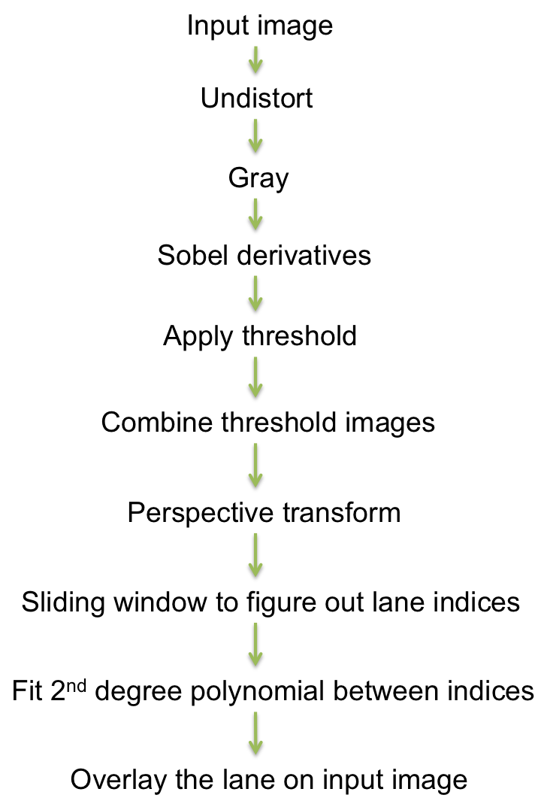

# Objective

The main objective of this project is to detect lane lines in a given video feed and mark the lane on the video using opencv functions. This is different from the first project in a way that first project only used sobel derivatives to figure out edges and from there, figure out the lane lines. This project uses more extensive opencv functions like camera calibration, undistorting images and perspective transform to more accurately figure out a lane. 

# Implementation pipeline

## Steps



Images taken from a camera suffer distortion because lenses produce curved lines where straight lines should be. For correcting distortion, we would need to calibrate the camera. 

Calibration of camera is done using chessboard images given to us which are taken from the same camera that also shot the videos for lane detection. For doing this, the chessboard images are converted to grayscale and then OpenCV functions, 'findChessboardCorners' assuming the board is 9x6 images (One image is 9x5 and the rest are 9x6). 'calibrateCamera' function of OpenCV is used to find out the camera matrix along with distortion co-effecients. These matrices are needed to distort other images taken from the same camera.

Calibration code is in calibrate.py


Calculation of the camera matrices and distortion coefficients takes a considerable computation time so they are saved to disk for further usage as 'camera.p' file

These matrices and co-efficients are used on test_images to undistort the images and run the pipeline on before running it on the video. As a first step, the images are undistorted and then converted to grayscale.


On the undistorted image, Sobel derivates are run in x, y directions along with magnitude and direction thresholds. All these images are converted to binary with certain thresholds values. The undistorted image is also converted to HLS colorspace and 'S' layer image is taken and also applied threshold upon. A combined image is generated by using all these binary images. This image will be used to figure out lanes in an image. This is done because each of the derivatives is good in one aspect. However, when all of them are combined, more relavant data is preserved in the image than each of them independantly. 


The binary image is then passed through a perspective transform to warp the image to a bird's eye view. That view is easier to find the lane lines. 


After applying camera calibration, thresholding and perspective transform, the lane lines stand out. However we still need to figure out which pixels are lane lines and specifically which ones belong to left lane and which ones belong to right lane. To do this, a histogram of the bottom half of the image is taken. 

All the code for helper functions is in binarize.py


The image is now partitioned into 9 horizontal slices. From the bottom slice, put up a 200 pixel wide image around the 'hot' pixels based off of histogram. Go up the slices and adjust the pixel windows around the pixels that can be part of left or right lanes. Center the windows in accordance with the pixels in the window. After going through all the slices, we should end up with indices that can be part of left lane and right lane. Once we have the indices, we can attempt to fit a 2nd degree polynomial function between those points which will become our lane line. 

### Calculating radius of lane, vehicle offset

#### Radius

Once we have the left and right lane polynomials, we can use the forumlae given in the lecture notes to figure out the radius of curvature of the lanes. To map the values from pixel space to real world space, factors need to be multiplied to pixels as mentioned in the lectures. Multiplying factors are 30m for 720 pixels in Y direction and 3.7m for 700 pixels in X direction. 

#### Vehicle Offset

Assuming that the center of vehicle is in center of the image, vehicle offset can be calculated by averaging out the x indices of bottom of right lane and left lane and subtracting from center of image. 

## Final Image

Once the lanes are determined, we do perspective transform of the our warped image back using the inverse of the matrix that we originally determined. 

We create a blank image first, layover our left and right lanes, fill the space between the lanes with a color of choice. This image is overlaid on top of original undistorted image to result in final image with lane lines marked.

Required code is in process.py


The same algorithm is run on the entire video using moviepy library functions. The output can be found in project_video-output.mp4 file

## Thoughts and things to improve

* My code did not work on other videos on the project. I guess I would need to figure out false positives and ignore them into my lane calculations but I have not been able to accurately do it. 
* I tried skipping the sliding window but I kept getting compilation errors. I will try to optimize my program once I get more time to spend on it.


```python

```
